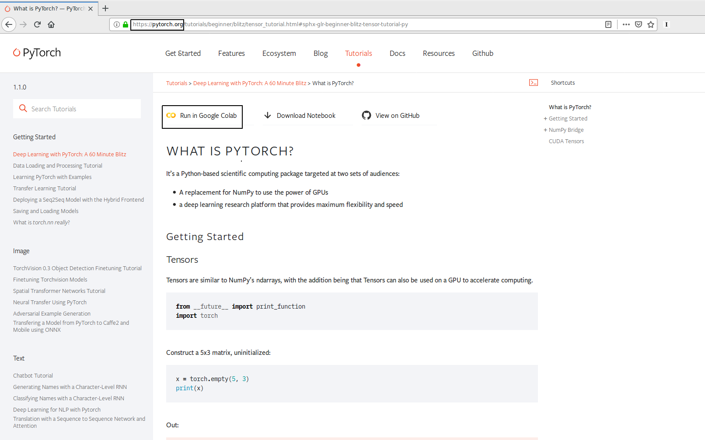
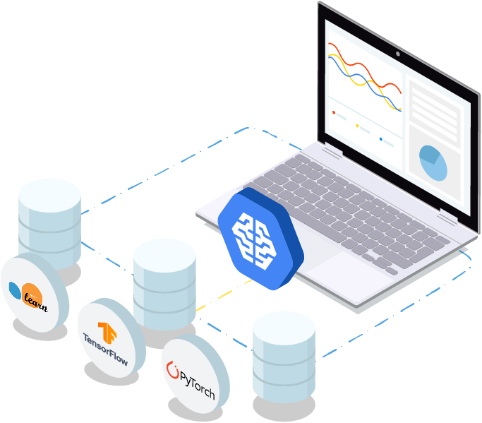

# Google Colaboratory
#  & AI Notebook

## Data Science in the cloud, the easy way

Toulouse Data Science #38 - June 18th 2019

Florient CHOUTEAU

--

### about.md


- ML Engineer @ Airbus Defence and Space (Space Systems)

- Training Neural Networks on remote sensing imagery since 2016 

    - Delair, Magellium & Airbus Intelligence (**w/ Jeff, spoilers**), Airbus DS...

    - torch, tf, keras, pytorch, ... 
    
    - a lot of time spent installing instances

- Contact: [@foxchouteau](https://twitter.com/foxchouteau) or on Slack

--

### Who started learning data science recently ?

--

### Who works in data science ?

--

### Who teaches data science classes ?

--

### TL;DR

- easy access to configured development environment for ML

- from Google but not limited to their tech

- jupyter-based products

- one free, one paid: different use cases, similar principles

--

### Disclaimer

This talk is not sponsored by Google ;)

There may be better alternatives: Feel free to comment after :)

---

## Colaboratory

https://colab.research.google.com


--



--

### WTF is... Google Colab ?

- Jupyter Notebook + Google Drive

- Full python data science environment

- 12h max session lifetime

--

### Is it for YOU ? 

- Students, people learning ML/DS

- Teachers, share courses, get assignments

- Quick experiments / sharing 

--

### Nice features

- Can use your data: gdrive, gsheet, local filesystem

- Jupyter-based: All the power of interactive & visualisations

- You can `apt-get` and `pip install` what you need

--

### Nicer features

- GPU ! (Nvidia Tesla T4, 16 GB GPU RAM = 3000$)

- Collaboration ! (share and co-edit notebooks)

- Open notebook from github to colab ! 

--

### Demo Time

- End-to-end training w/ GPU. pytorch and [pytorch-ignite](https://github.com/pytorch/ignite)

- Notebook on github, Data on Google Drive

- https://colab.research.google.com

--

### Limitations

- Long calculations w/ guarantees (you can checkpoint your models on colab though)

- Code syncing / huge codebase & huge datasets

- Full control over installation and data

---

## GCP Deep Learning VM / AI Platform Notebook

https://cloud.google.com/deep-learning-vm/



--

### Google Cloud Platform

- Cloud Provider, very nice VM instances options

- 300$ free, paid for GPU and unlocked bandwidth

- Rather easy to use for ML / DS

--

### WTF is... AI Platform Notebook ?

- Pre configured **paid** Cloud Virtual Machines (Google Compute Engine)

- With jupyter lab auto launched & ready

- Papermill pre installed for scheduling

--

### Available configurations


--

### 2 different workflows

1. Jupyter only ("AI Notebook")

2. Pre-configured instance for Data Science ("Deep Learning VM")

--

### Demo 1: "AI Platform Notebook"

- Creating an instance

- Connecting to jupyter lab (with or without ssh !)

https://console.cloud.google.com

--

### Demo 2: "Deep Learning VM"

- Using the DL VM as a preconfigured headless code runner

- Executing a notebook on a deep-learning-vm

- Install this: https://github.com/gclouduniverse/gcp-notebook-executor

```
INPUT_NOTEBOOK="gs://{your-storage}/ai-notebook-demo.ipynb"
GCP_BUCKET="gs://{your-storage}/runs"
IMAGE_FAMILY_NAME="pytorch-latest-gpu"
INSTANCE_TYPE="n1-standard-8"
GPU_TYPE="k80"
GPU_COUNT=1
ZONE="europe-west1-b"

execute_notebook -i "${INPUT_NOTEBOOK}" \
                 -o "${GCP_BUCKET}" \
                 -f "${IMAGE_FAMILY_NAME}" \
                 -t "${INSTANCE_TYPE}" \
                 -z "${ZONE}" \
                 -g "${GPU_TYPE}" \
                 -c "${GPU_COUNT}"
```

--

### Advanced Usage (not covered here)

- [Extensive tutorial](https://towardsdatascience.com/how-to-use-jupyter-on-a-google-cloud-vm-5ba1b473f4c2)

- Use "preemptible" (spot in AWS terminology)*

- CLI creation for more customization

*5x less expensive, run only 24h

---

## Conclusion

-- 

### TL;DR (bis)

 <table style="width:100%">
  <tr>
    <th>Google Colab</th>
    <th>Google AI Notebook</th>
  </tr>
  <tr>
    <td>Learn, experiment </td>
    <td>Can scale compute</td>
  </tr>
  <tr>
    <td>Single notebook / Clone from github</td>
    <td>Upload own code</td>
  </tr>
  <tr>
    <td>Simple jupyter env.</td>
    <td>Full jupyter lab or SSH access</td>
  </tr>
  <tr>
    <td>Data from anywhere / google drive</td>
    <td>Fully owned cloud environment</td>
  </tr>
  <tr>
    <td>Short runtimes</td>
    <td>Cheap 1d runtimes or arbitrary runtimes</td>
  </tr>
  <tr>
    <td>**free**</td>
    <td>**[paid](https://cloud.google.com/compute/pricing)** (by minute of computing + storage)</td>
  </tr>
</table> 

--

### Alternatives

- [Kaggle Kernels](https://www.kaggle.com/kernels): for kaggle, colab, free, 9h, P100

- [Amazon Sagemaker](https://aws.amazon.com/sagemaker/): can someone tell me about it ?

- A lot of smaller entities... [floydhub](https://www.floydhub.com/)...

- Build your own machine ? opinion: last step for individual use (be sure of what you need !)

--

### Thank you !
