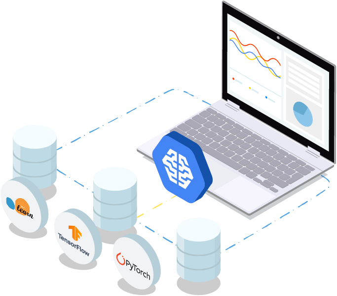

# Google Colaboratory & AI Notebook

## Easy & Accessible Computing for Data Science

Toulouse Data Science #38 - June 18th 2019

Florient CHOUTEAU

--

### about.md

- Florient CHOUTEAU @ Airbus Defence and Space

- Training Neural Networks since 2016 

    - Remote sensing imagery
    - Delair, Magellium, then Airbus
    - torch, tf, keras, pytorch, ... 

- I am not sponsored by Google :)

--

**Who started learning data science recently ?**

-- 

**Who works in data science ?**

--

**Who teaches data science classes ?**

--

### TL;DR

- easy access to configured development environment for ML

- from Google but not limited to their tech

- jupyter-based products

- one free, one paid: different use cases, similar principles

--

### Disclaimer

I don't quite like notebooks ;) ... but I use them a lot

I didn't check every alternative product: Some may be better

---

## Colaboratory

-- 

--

### WTF is... Google Colab ?

--

### Is it for YOU ? 

- Students, self-learning

- Quick experiments / colaboration

--

### Interesting Features

- With GPU option ! (Nvidia T4 = 3000$)

- Limited in time 

--

### Interesting Features 

- Access to google drive data

- Can upload / download directly from colab 

--

### Demo !

- End-to-end training w/ GPU
- Data on Google Drive
- Saving model locally

https://colab.research.google.com

--

### Limitations

- Long calculations w/ guarantees

- Full control over installation and data

---

## Deep Learning VM / AI Platform Notebook

--

### So you came from Colab ?

--

### WTF is... AI Platform Notebook

--

### Features

--

### Workflow

--

### Demo

- Creating an instance
- Connecting to jupyter lab
- Using it as a computing machine w/ notebook executor

https://console.cloud.google.com

---

## Conclusion

-- 

### TL;DR (bis)

--

### Alternatives

- Kaggle Kernels

- Amazon Sagemaker

- A lot of companies with to-rent servers

- ... Build your own box ? 

--

### Thank you ! 